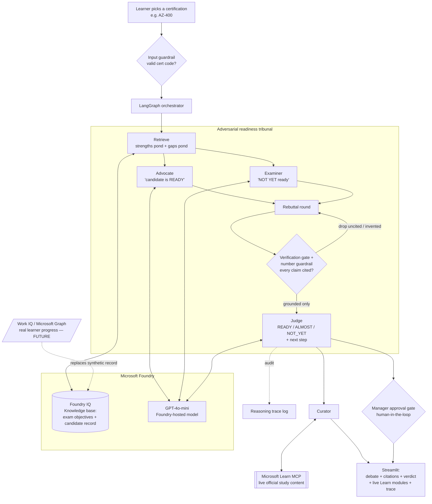

# ReadyIQ — Architecture

> *Test before the test.* An adversarial multi-agent certification-readiness system on Microsoft Foundry.

**Track:** Reasoning Agents → **Challenge A (Enterprise Learning System)**
**Hackathon:** Microsoft Agents League @ AI Skills Fest 2026 · deadline June 14, 2026
**Author:** Robert Borkar (RobertB-38) — MSc Computing (Data Analytics), DCU

> ⚠️ **Synthetic data only.** All candidate records and exam-objective documents are fabricated. No real learner data or PII.

---

## 1. The idea

Certification readiness is usually a guess — a single practice score and a gut feel. ReadyIQ puts readiness **on trial**: two agents argue opposing sides, a Judge decides, and every claim is cited to the exam objectives or the candidate's record. The system refuses to answer when the evidence isn't there. It's the *adversarial* take on Challenge A — where the rest of the field builds linear curate→plan→quiz pipelines.

---

## 2. System diagram

---

## 3. Components

**Input guardrail.** Rejects anything that isn't a valid certification code before a model call is spent.

**Retrieve (Foundry IQ).** Two tuned queries fetch a *strengths* pond (for the Advocate) and a *gaps* pond (for the Examiner) from the knowledge base — the exam objectives and the candidate's synthetic practice record — then pool them so the gate, rebuttals, and Judge share one citable basket.

**Advocate.** Argues, persuasively and honestly, that the candidate is **ready** — leading with strong domain scores and met thresholds, reframing weaknesses as surmountable. Never decides the verdict.

**Examiner.** Argues the candidate is **not yet ready** — leading with the most decisive gaps in heavily-weighted domains.

**Rebuttal round.** Each agent reads and counters the other. This is the multi-step reasoning core — argument → counter-argument, not two parallel opinions.

**Verification gate + number guardrail (Reliability & Safety).** Drops any claim not backed by a retrieved passage, and any claim citing a score not present in its source. This is the anti-hallucination control — you can watch it refuse.

**Judge.** Weighs the full transcript and returns **READY / ALMOST / NOT_YET**, a confidence score, the deciding evidence, and one concrete next step. A weak score in a heavily-weighted domain outweighs minor strengths.

**Curator (Microsoft Learn MCP).** When the verdict isn't READY, ReadyIQ calls the public **Microsoft Learn MCP server** (`microsoft_docs_search`) for *live, official* study content on the weak area — real, current Learn modules, not static text. Public docs only; no PII.

**Human-in-the-loop gate.** The verdict is advisory until a manager approves or overrides it — agents have no authority to act alone.

**Reasoning trace.** Every step is logged for audit.

---

## 4. Microsoft IQ & tooling

| Layer | Tool | Role |
|---|---|---|
| Grounded retrieval | **Foundry IQ** (Azure AI Search) | Exam objectives + candidate record, cited |
| Reasoning model | **GPT-4o-mini on Microsoft Foundry** | Advocate / Examiner / Judge |
| Orchestration | **LangGraph** | Multi-agent debate state machine |
| Live content | **Microsoft Learn MCP** | Real study modules for the gaps |
| Reliability | Verification gate + guardrails + human approval | Anti-hallucination + oversight |
| UI | Streamlit | Two-column debate, citations, verdict, trace |

---

## 5. Future state (vision — not built)

Embedded inside the **Microsoft Learn portal**, ReadyIQ needs no login: the learner is already authenticated, and their **real** progress flows through **Work IQ / Microsoft Graph** (with consent), replacing today's synthetic candidate record. A learner clicks "Am I ready?", the same Advocate–Examiner–Judge tribunal runs on their actual data, and they get a cited verdict plus live Learn modules — all inside their own portal, their data never leaving their tenant. Foundry IQ and the Learn MCP stay exactly as they are; only the candidate-record source changes.

---

## 6. Submission checklist (Challenge A)

- [x] Multi-agent system aligned to the enterprise-learning scenario
- [x] Microsoft Foundry (model) + Foundry IQ (knowledge)
- [x] Reasoning & multi-step thinking (opening → rebuttal → verdict)
- [x] External tool / MCP that adds real value (Microsoft Learn MCP)
- [x] Grounded, cited assessment + human oversight
- [x] Synthetic data only
- [ ] Demo video (≤5 min) + public GitHub repo + this diagram → submit on Innovation Studio
